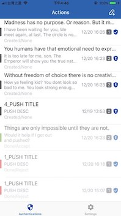
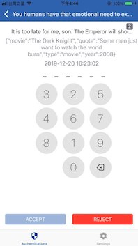
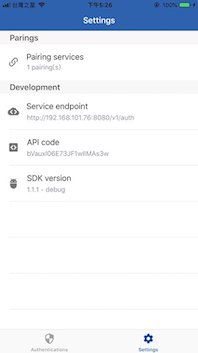

# CYBAVO Auth SDK for iOS - Sample

Sample app for integrating Cybavo Authenticator SDK, https://www.cybavo.com/





# CYBAVO

A group of cybersecurity experts making crypto-currency wallet secure and usable for your daily business operation.

We provide VAULT, wallet, ledger service for cryptocurrency. Trusted by many exchanges and stable-coin ico teams, please feel free to contact us when your company or business need any help in cryptocurrency operation.

# Run the demo app
1. Suggest using Xcode 14 and CocoaPods 1.9.3+. 
1. In ~/.ssh/ create a file called config with contents based on this:
    ```
    Host bitbucket.org
    HostName bitbucket.org
    User git
    IdentityFile ~/.ssh/{{your private key}}
    ```
2. ⚠️ From `CYBAVOAuth 1.2.239`, please put following `post_install` hook in the Podfile.

    ```sh
    post_install do |installer|
      installer.pods_project.targets.each do |target|
        target.build_configurations.each do |config|
          config.build_settings['BUILD_LIBRARY_FOR_DISTRIBUTION'] = 'YES'
        end
      end
    end
    ```
3. Run ```pod install``` to install all dependencies.
4. Open ```CYBAVOAuth.xcworkspace``` in xcode.
5. Edit `Settings.bundle`/`Root.plist` ➜ `SERVICE_ENDPOINT` to your Auth Service endpoont. (or edit it later in Settings)
6. Edit `Settings.bundle`/`Root.plist` ➜ `SERVICE_API_CODE` to fill in your API Code. (or edit it later in Settings)
7. Now you can run it on your device!
  
# Initialization in your app
Create Authenticator by following code.
```swift
    let shared = Authenticator.create(endPoint:<Your endpoint url>,apiCode: <Your API code>, apnsSandbox: <true if is apns sandbox>)
```    
# Push notification
To enable push notification feature, setup project to register APNS. Refer to [official document](https://developer.apple.com/documentation/usernotifications/registering_your_app_with_apns) for details


# Features
- Pair/unpair device with service
- Fetch two-factor authentication actions from backend
- Respond to two-factor anthentication actions, with or without PIN code
- Receive push notifications for two-factor authentication
- Secure PIN code input view